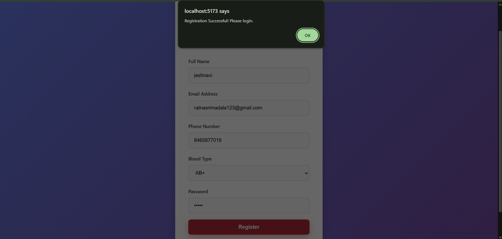
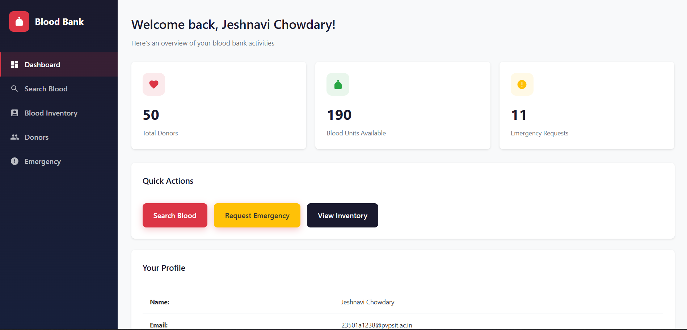
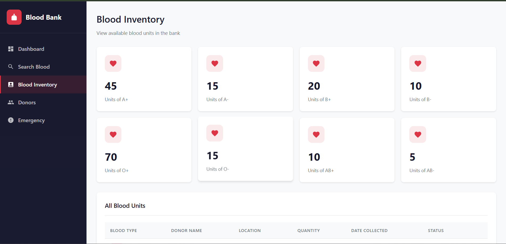
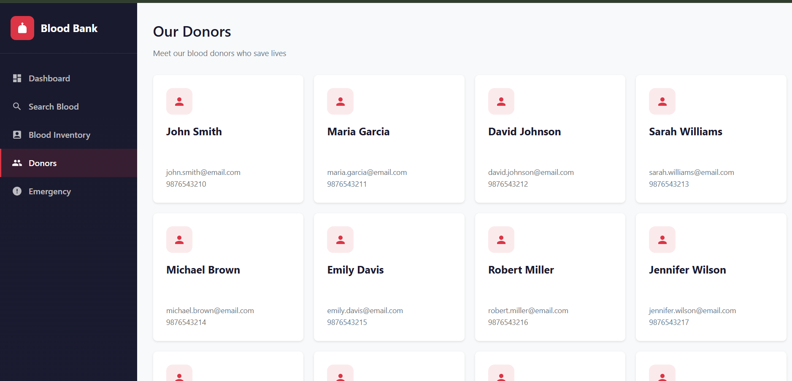
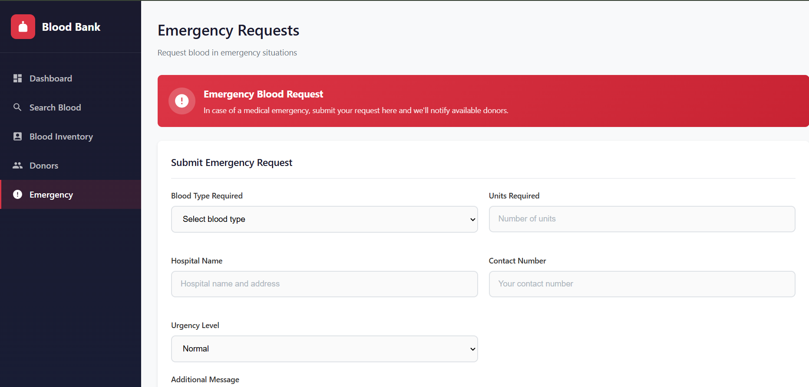
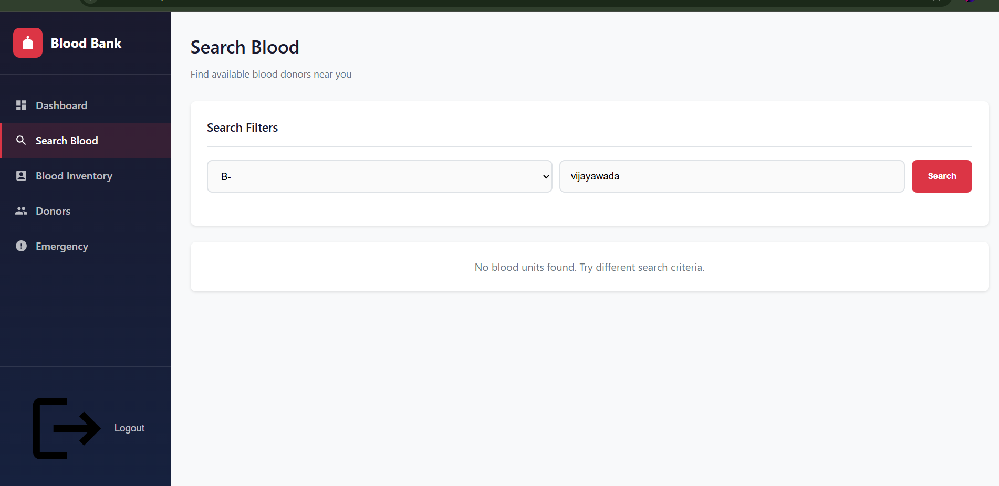

# 🩸 Smart Blood Bank

A full-stack Blood Bank Management System built using the MERN Stack to manage donors, blood inventory, blood search, and emergency blood requests.

##  Features

- User Registration & Login
- Blood Inventory Management
- Donor Management
- Blood Search Functionality
- Emergency Blood Request Handling
- Dashboard with Statistics
- MongoDB Database Integration

## 🛠 Tech Stack

### Frontend
- React.js
- Vite
- JavaScript
- HTML
- CSS

### Backend
- Node.js
- Express.js

### Database
- MongoDB

## 📸Screenshots

### Login Page

### Registration Page

### Dashboard

### Blood Inventory

### Donor Management

### Emergency Requests

### Blood Search

## Skills Demonstrated

- MERN Stack Development
- REST API Development
- MongoDB Integration
- Authentication & Authorization
- Frontend-Backend Integration
- Dashboard Development
- Git & GitHub Version Control

##  Author

Jeshnavi Madala

GitHub: https://github.com/MadalaJeshnavi

LinkedIn: https://www.linkedin.com/in/jeshnavi-madala

## Live Demo

Frontend: https://smart-blood-bank.vercel.app  
Backend API: https://smart-blood-bank-1.onrender.com